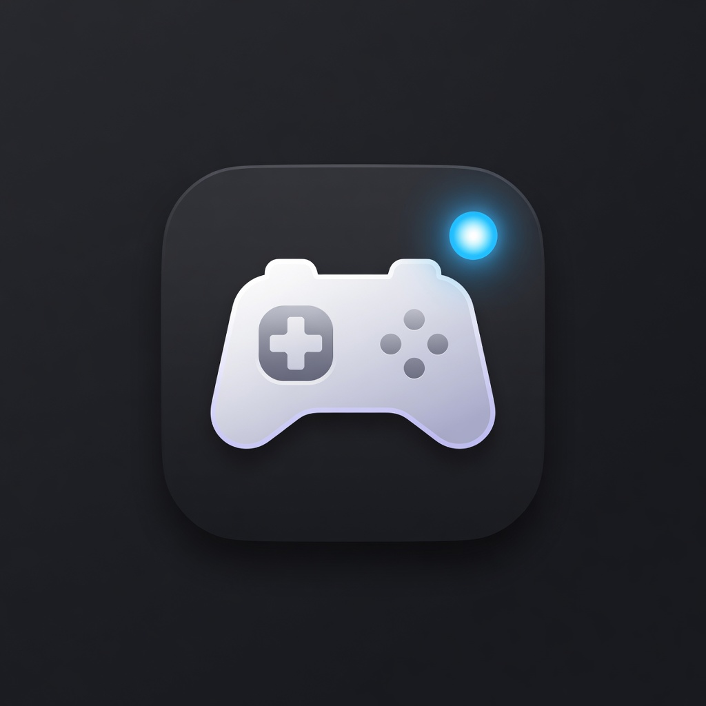

# Game Presence

<p align="center">
  
</p>

A [Decky Loader](https://github.com/SteamDeckHomebrew/decky-loader) plugin that shows the game you are playing on Discord while Steam is in Game Mode.

Friends see a normal Discord **Playing** status, with the official game name and artwork when Discord knows the title.

## Install

You need [Decky Loader](https://github.com/SteamDeckHomebrew/decky-loader) and a logged-in Discord account on the same machine.

### ZIP (easiest)

1. Download [`GamePresence.zip`](https://github.com/YAHUkhannan/decky-game-presence/releases/latest/download/GamePresence.zip) from [Releases](https://github.com/YAHUkhannan/decky-game-presence/releases).
2. Game Mode → Quick Access menu → **Decky** → settings (gear).
3. Turn on **Developer mode**.
4. Use **Install Plugin from ZIP** (sometimes labeled **Manual plugin install**).
   - If it asks for a URL, paste:  
     `https://github.com/YAHUkhannan/decky-game-presence/releases/latest/download/GamePresence.zip`
   - If it lets you pick a file, choose the zip you downloaded.
5. Open the Quick Access menu → **Game Presence** → leave **Show activity** on.

That link always points at the newest release, so it never needs updating here.

### Install script

For desktop mode, or if you reinstall often. Needs a terminal.

```
curl -L https://raw.githubusercontent.com/YAHUkhannan/decky-game-presence/main/install.sh -o install.sh
bash install.sh
```

It downloads the current `main`, offers to install Decky Loader first if it is not
found, and copies the plugin into `~/homebrew/plugins/decky-game-presence`. It asks
for `sudo` because that directory is owned by root.

Restart Decky afterwards (`sudo systemctl restart plugin_loader`) so the plugin is
picked up. If you already installed through the ZIP, remove the old
`~/homebrew/plugins/GamePresence` folder first, or Decky will list the plugin twice.

### Folder copy

Copy the `GamePresence` folder into `~/homebrew/plugins/` and restart Decky. Same plugin, more steps.

## Usage

Launch a game from Steam. After a few seconds, Discord should show that title.

- **Show activity** — turn reporting on or off
- **Now playing** — the title currently sent to Discord
- **Reconnect** — appears if Discord did not accept the status
- **Clear** — remove the status

## How it works

Discord will only show **Playing [game]** if a Discord client is running. Game Mode normally tears that client down, so the old workaround was to keep Discord open as a Steam tab.

This plugin does three things instead:

1. **Detect the current game.** It watches Steam’s running-app events. If Steam does not list the title in the overlay, it also reads the Steam App ID from the running process (the same `AppId=` / `SteamAppId=` values Steam already uses to launch the game) and looks up the name from your installed `appmanifest_*.acf` files or Discord’s public game list.
2. **Match Discord’s official game.** It uses [Discord’s detectable applications list](https://discord.com/api/v10/applications/detectable) and the Steam App ID so the status uses Discord’s real application (name + cover), not a generic placeholder.
3. **Keep a background Discord client only while you play.** The client runs on a dummy display, at low priority, and is stopped when the game exits. The plugin holds the Rich Presence connection open for the whole session so Discord does not fall back to the raw `.exe` name.

This is Discord Rich Presence only. It does not Go Live, share video, or change what Steam friends see.

## Requirements

- Linux / Steam Deck / CachyOS Deckify (or similar) with Decky Loader
- Discord installed and logged in (`discord` from your distro, not only Flatpak)
- `Xvfb` (`xorg-server-xvfb` on Arch)

## Development

```
GamePresence/
  plugin.json
  package.json
  main.py
  dist/index.js
  LICENSE
  README.md
```

After editing, copy into `~/homebrew/plugins/GamePresence/` and restart the `plugin_loader` service.

## License

MIT
